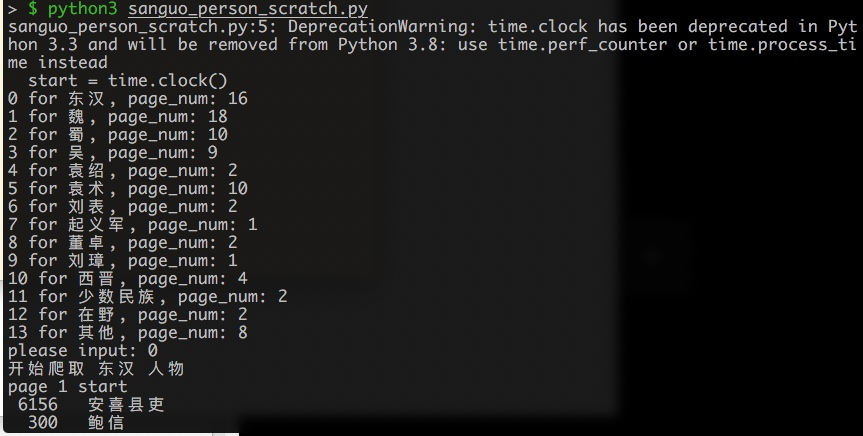
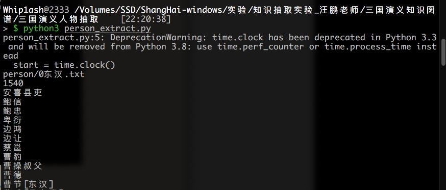
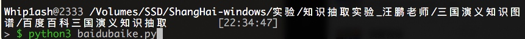
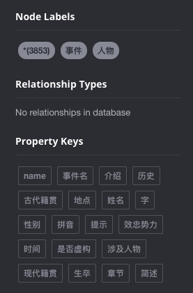
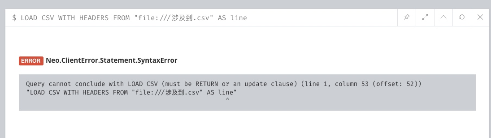
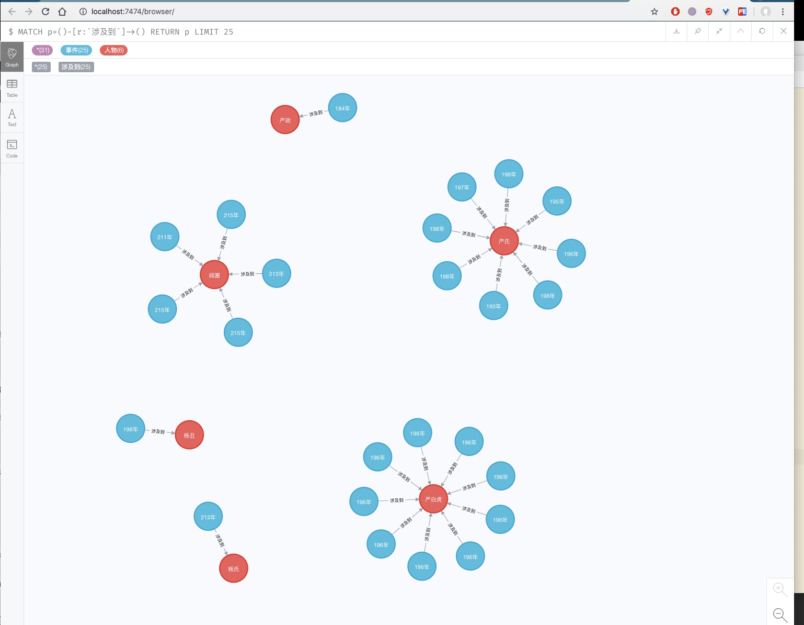

# 三国演义知识图谱
## 三国演义人物抽取

知识抽取实验_汪鹏老师/三国演义知识图谱/三国演义人物抽取


这个有点蠢，不能直接都爬，还需要一个一个选择。由于只是复现，这里就不改代码了。

转化成json格式。



## 通过人物获取百度百科的信息


## 导入实体
neo4j启动

更改
知识抽取实验_汪鹏老师/三国演义知识图谱/neo4j导入/实体导入/import_entity.py
的端口和密码

执行


没有输出

侧边栏出现属性则导入成功
## 导入关系
```
将需要导入的数据（涉及到.csv）复制到C:\Program Files\NEO4J\neo4j-community-3.5.8\import

用浏览器打开neo4j界面，在命令行  一次性  (重点) 输入以下指令：
LOAD CSV WITH HEADERS FROM "file:///涉及到.csv" AS line
match (from:事件{事件名:line.subject}),(to:人物{姓名:line.object})
merge (from)-[r:涉及到]->(to)
```



没有一次性输入报这种错误


成功则如图


## 疑问
不知道csv怎么导出来的，可能通过网络上的api直接获取。
neo4j居然没有持久化，不过目前不影响，后续看如何持久化。