# 金庸知识图谱实验环境搭建及复现

初次复现实验使用虚拟机可以直接根据readme操作。以下为readme内容：

```
# 1_crawl-novel、2_data_preprocess、3_crawl-baike三个目录下的实验为数据抽取，需要连接网络，而且耗时较长，为方便，可以直接将data目录下的数据导入mongoDB即可，导入方法见data目录下的readme.txt。


1、1_crawl-novel从网页上爬取金庸小说原文，存入mongoDB：
cd C:\Users\KG_ex\Desktop\知识抽取\金庸知识图谱\experiment\1_数据爬取\1_crawl-novel\xiaoshuo_spider\spiders
scrapy crawl xiaoshuo_spider


2、2_data_preprocess对数据进行预处理，extract_persons.py从数据库里的小说中抽取出人名，生成"persons.txt"文件(这个过程很慢)；covert.py将小说导出为txt格式，生成books文件夹。
cd C:\Users\KG_ex\Desktop\知识抽取\金庸知识图谱\experiment\1_数据处理\2_data_preprocess
python extract_persons.py
python covert.py


3、3_crawl-baike 以上一步生成persons.txt中的人名为关键词，爬取百度百科中的相关知识，并存入MongoDB：
cd C:\Users\KG_ex\Desktop\知识抽取\金庸知识图谱\experiment\1_数据处理\3_crawl-baike\person\spiders
scrapy crawl person_spider

############################################
```

```
1_mongo2neo将mongoDB中的数据导入Neo4j中
cd C:\Users\KG_ex\Desktop\知识抽取\金庸知识图谱\experiment\2_项目部署\1_mongo2neo
python mongo2neo.py

数据导入成功后可访问http://localhost:7474，查看导入的数据。


2_kgqa为问答系统，在目录下启动服务即可使用：
cd C:\Users\KG_ex\Desktop\知识抽取\金庸知识图谱\experiment\2_项目部署\2_kgqa
python app.py

启动 flask 程序，然后在浏览器中访问 http://127.0.0.1:8000 即可访问
试着输入“张无忌有什么武功？”、“郭靖的妻子是谁？”

```


## Env
Mac 10.14.6

## Content
### MongoDB环境安装
https://docs.mongodb.com/manual/tutorial/install-mongodb-on-os-x/

brew tap mongodb/brew
brew install mongodb-community@4.2
brew services start mongodb-community@4.2

ps aux | grep -v grep | grep mongod
有线程则成功
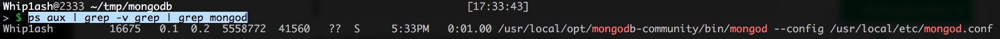

mongo连接到数据库，能连接上则成功。
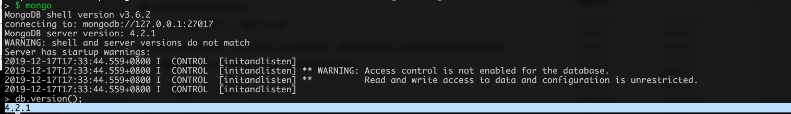

由于MongoDB默认账号密码为空，建议如果不用的时候关闭，并且禁止开启启动。

### neo4j环境安装
本机存在java环境，故略过jdk的配置，此处有问题可以google。

我这里安装的server版本的，Desktop版本应该也可跑。
https://neo4j.com/artifact.php?name=neo4j-community-3.5.13-unix.tar.gz

这里是server版本的安装指南 
https://neo4j.com/docs/operations-manual/current/installation/osx/

解压，进入文件路径直接跑就好了
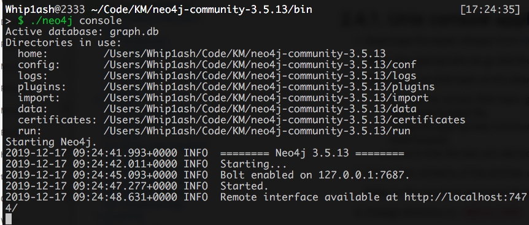

初始账号密码都是
neo4j

能看到如下页面则成功。
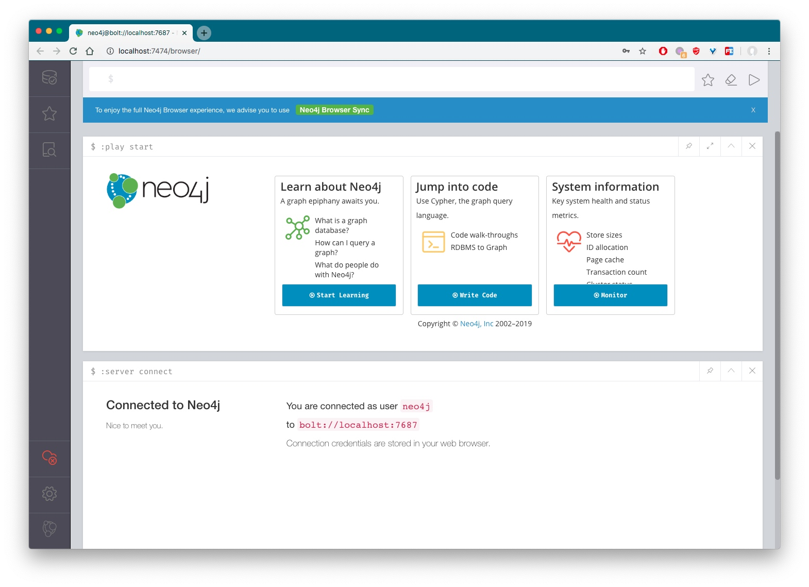

### python依赖

pip3 install -i https://pypi.tuna.tsinghua.edu.cn/simple jieba requests scrapy pymongo py2neo


### 导入data

目测爬虫的数据源挂掉了。我这里直接从data中导入了，readme如下

```
0、若已经爬取了部分数据，需要先清空再进行导入。
在cmd下输入mongo，进入mongoDB控制台。
在mongoDB控制台下依次输入以下命令，删除数据库中残留的数据。
show dbs
use jinyong
db.dropDatabase()
exit

1、导入人物数据
cd C:\Users\KG_ex\Desktop\知识抽取\金庸知识图谱\experiment\1_数据处理\data
mongoimport -d jinyong -c persons --jsonArray persons.json

2、导入小说数据
cd C:\Users\KG_ex\Desktop\知识抽取\金庸知识图谱\experiment\1_数据处理\data
mongoimport -d jinyong -c xiaoshuo --jsonArray xiaoshuo.json
```

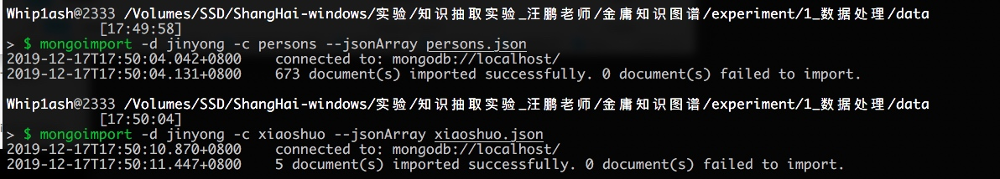

### 执行cover.py 

知识抽取实验_汪鹏老师/金庸知识图谱/experiment/1_数据处理/1_crawl-novel/cover.py 
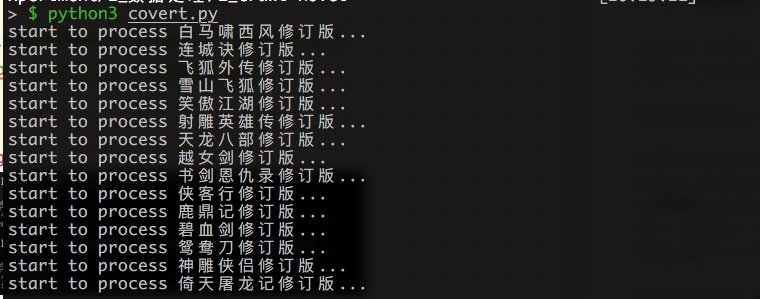

### 通过分词获取人名

文档中使用的*jieba*这个库，但是实际上*xmnlp*和*tqdm*。

[“结巴”中文分词：做最好的 Python 中文分词组件](https://github.com/fxsjy/jieba)
[小明NLP：提供中文分词, 词性标注, 拼写检查，文本转拼音，情感分析，文本摘要，偏旁部首](https://github.com/SeanLee97/xmnlp)
[tqdm means "progress" in Arabic (taqadum, تقدّم) and is an abbreviation for "I love you so much" in Spanish (te quiero demasiado).](https://tqdm.github.io/)

执行 
知识抽取实验_汪鹏老师/金庸知识图谱/experiment/1_数据处理/2_data_preprocess/extract_persons.py

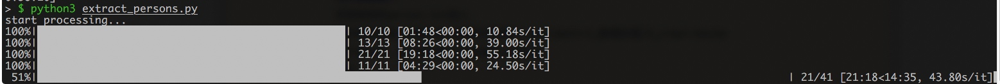


### 爬取百度百科
把获取到的person.txt放入
知识抽取实验_汪鹏老师/金庸知识图谱/experiment/1_数据处理/3_crawl-baike
这个路径中，这个爬虫的工作目录默认是在这
执行
scrapy crawl person_spider

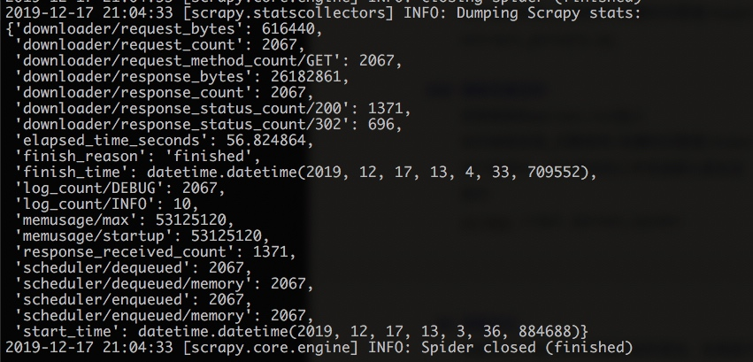

### 将 mongodb 的数据导⼊ neo4j

路径在这
知识抽取实验_汪鹏老师/金庸知识图谱/experiment/2_项目部署/1_mongo2neo
将端口更改为本机neo4j的端口 更改password为自己的密码
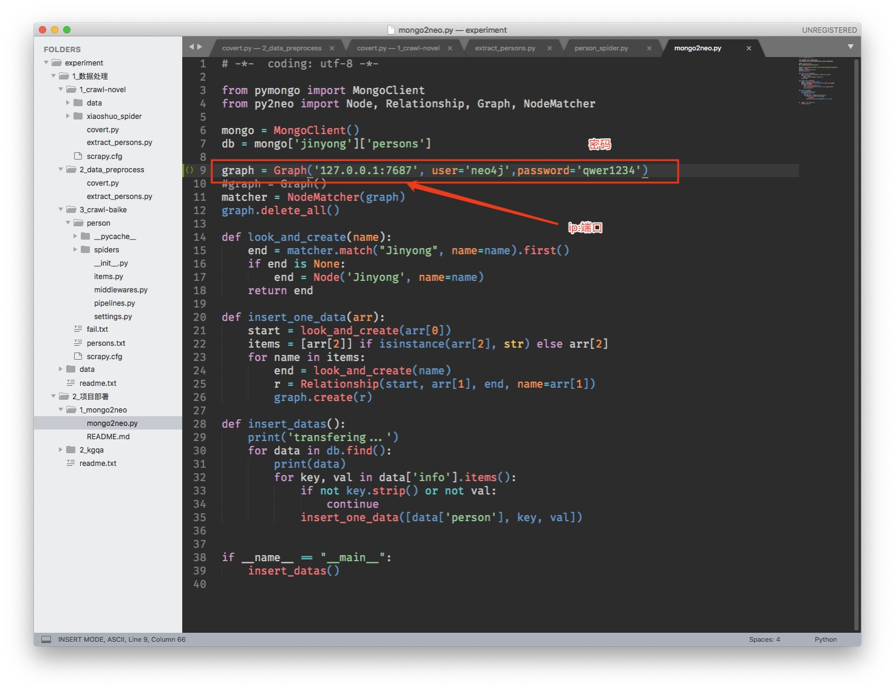


此时neo4j应该已启动。

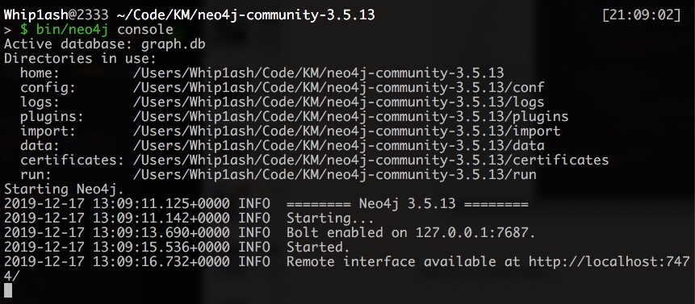

执行
python3 mongo2neo.py
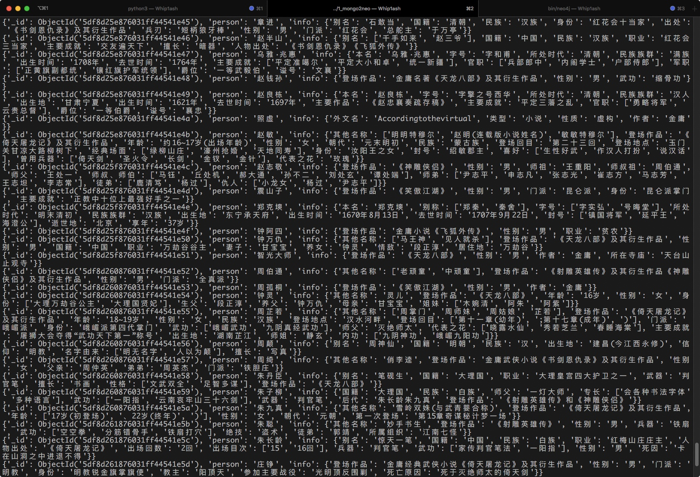
导入结果如图

打开neo4j，此时左侧关系类型应有值
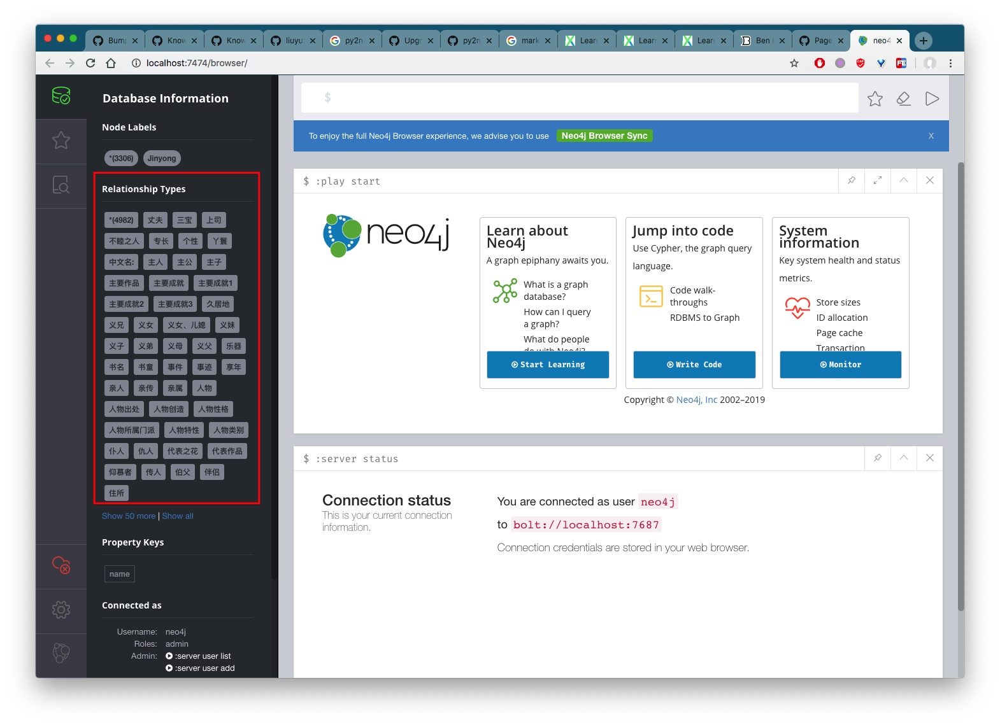

console中执行

match (n) where n.name='张无忌' return n

搜索出来张无忌相关的节点，相关的节点都可以双击点开
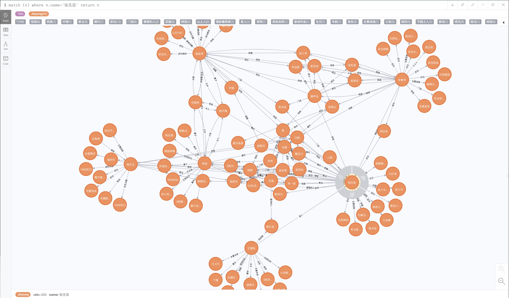

### 基于 d3.js 问答图谱可视化
项目路径如下
知识抽取实验_汪鹏老师/金庸知识图谱/experiment/2_项目部署/2_kgqa

建议将app.py中的host更改为127.0.0.1，否则他人可访问。
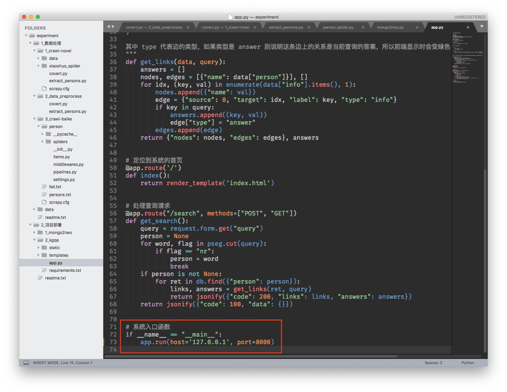

访问即可搜索
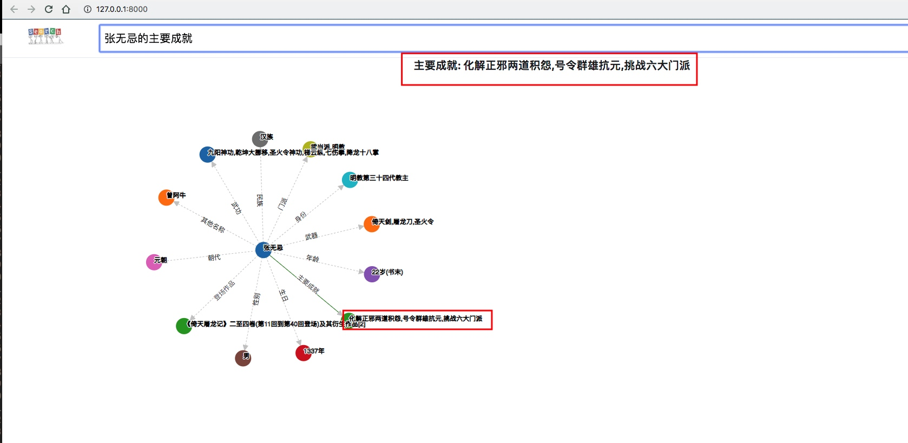


执行
 python3 app.py
 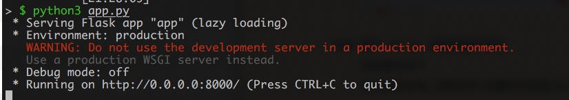


## 流程优化
前面有几个地方的文件路径我有更改，如果跑不起来看报错，考虑路径问题和没有库的问题。

