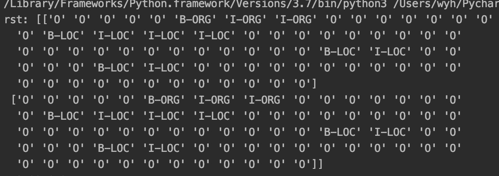

# # 基于BERT的中文命名实体识别扫盲及复现
本文档主要用于零基础上手Bert模型以及进行使用的过程。本实验是基于Bert-BLSTM-CRF的实验，可实现对新闻领域的具体如有错误，欢迎批评指正。
网址参考：https://blog.csdn.net/macanv/article/details/85684284
下面阐述一下具体概念：

##1.CRF
CRF 是一个序列化标注算法（sequence labeling algorithm），接收一个输入序列如 并且输出目标序列，也能被看作是一种seq2seq模型。例如，在词性标注任务中，输入序列为一串单词，输出序列就是相应的词性。
##2.BLSTM
blstm是基于lstm的一种双向的(Long Short Term Memory)。LSTM(Long Short-Term Memory) 长短期记忆网络，是一种时间递归神经网络，适合于处理和预测时间序列中间隔和延迟相对较长的重要事件。
B指的是bidirectional，即体现出来了一种双向的意思。
##3.实验过程
实验复现的过程经过了较长的过程，从读懂文档及概念再到实行，然后解决作者没有出现的问题花费了较长的时间。主要分为两步。
经过整理，整个的核心代码如下所示：
如果使用的下载的模型，你可以使用下面的命令启动，替换你自己的路径即可：
###3.1参数配置
    bert-base-serving-start -model_pd_dir /home/macan/ml/workspace/BERT_Base/output/predict_optimizer  \ 
	   -bert_model_dir /home/macan/ml/data\chinese_L-12_H-768_A-12/ \
	   -ner_model_dir /home/macan/ml/data/bert_ner \
	   -num_worker 8 
	   -mode NER

###3.2测试代码

    import time
    from bert_base.client import BertClient
    #指定服务器的IP
    with BertClient(ip='127.0.0.1', show_server_config=False, check_version=False, check_length=False, mode='NER') as bc:
    start_t = time.perf_counter()
    str = '1月24日，新华社对外发布了中央对雄安新区的指导意见，洋洋洒洒1.2万多字，17次提到北京，4次提到天津，信息量很大，其实也回答了人们关心的很多问题。'
    rst = bc.encode([str, str])  #测试同时输入两个句子，多个输入同理
    print('rst:', rst)
    print(time.perf_counter() - start_t)
###3.3输出结果

##4.参考
https://github.com/guillaumegenthial/tf_metrics/blob/master/tf_metrics/init.py

https://github.com/google-research/bert

https://github.com/kyzhouhzau/BERT-NER

https://github.com/zjy-ucas/ChineseNER

https://github.com/hanxiao/bert-as-service
提供了命名实体识别pb模型下载：https://pan.baidu.com/s/1m9VcueQ5gF-TJc00sFD88w, 提取码: guqq

