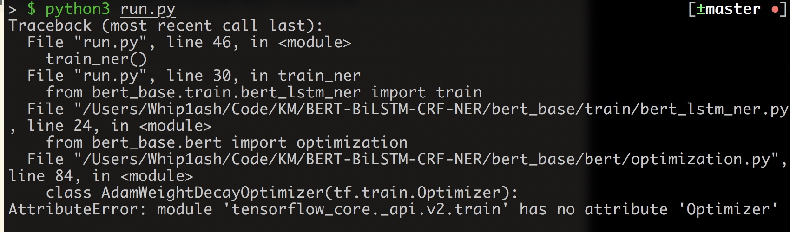

# 实体识别(BERT-BiLSTM-CRF-NER)预研
## Intro 
目前我对bert的了解甚少，能够用起来跑起来即可，无需深究其中实现与原理。以我现在的判断，这里主要分为两步，一个是使用相应的数据集进行训练，得到相应的模型，后续使用模型即可进行预测。

前期不考虑特定数据集的问题，先预研一下跑通流程，看看技术上的可实现性和难度。这里使用通用的模型。

这里的代码和文章也比较多，不太知晓其中的差别，所以先搞一个demo出来看看，调试和不同实现方法的比较放到后期专业的人手去做。

## Content
我用的这个
https://github.com/macanv/BERT-BiLSTM-CRF-NER

pip install bert-base==0.0.9 -i https://pypi.python.org/simple

bert-base-ner-train -help
发现没有tensorflow

pip3 install tensorflow -i https://pypi.tuna.tsinghua.edu.cn/simple

目测直接pip install 的TensorFlow的版本太高了。

pip3 install tensorflow==1.13.1 -i https://pypi.tuna.tsinghua.edu.cn/simple

未完待续.....